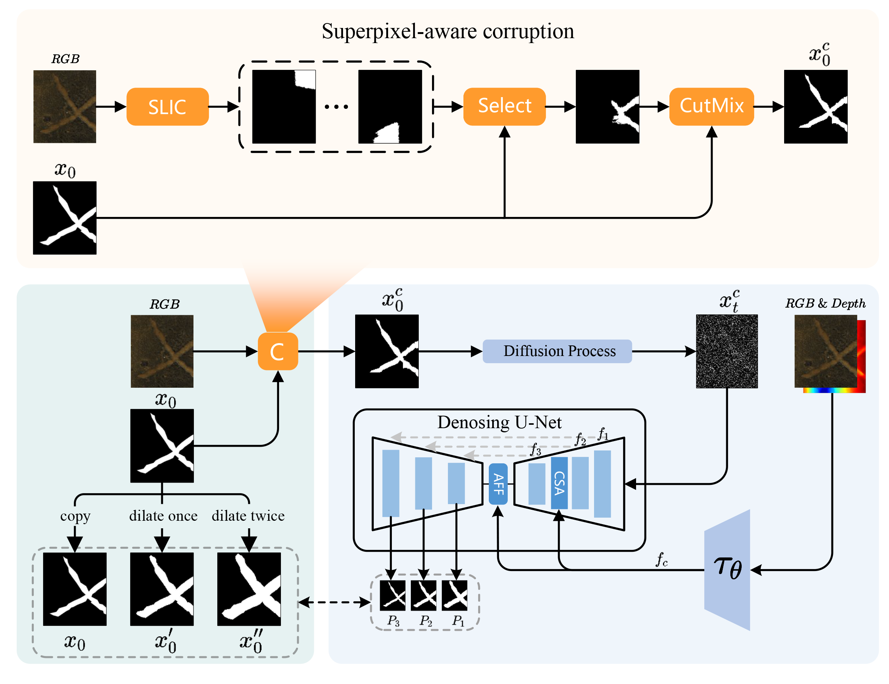

# DiffRSD: Diffusion-Based and Integrity-Aware RGB-D Rail Surface Defect Inspection

It has been accepted by TITS.

# Abstract
Rail quality evaluation ensures the safety of railway transportation, where rail surface defect inspection is one of important tasks. Traditional methods adopt encoder-decoder framework, which is difficult to extract discriminative defect features to achieve the integrity of defect inspection. In contrast, we propose DiffRSD, a diffusion-based method which restores the defect mask from a noise conditional on the RGB-D defect image, showing integrity-aware defect inspection ability by the following strategies: (a) superpixel-aware corruption; (b) coarse-to-fine dilation supervision. The first strategy can struggle the model to restore a defect mask from a corrupted mask and make the model rectify the error prediction in the inference stage. The second strategy can locate the defect region in the initial decoding stage and further depict the clear boundary in the later decoding ones. Both strategies improve the performance of defect inspection by experimental verification on NEU RSDDS-AUG RGB-D defect dataset, thus advancing the proposed DiffRSD beyond state-of-the-art methods. The generalization of DiffRSD is further verified by the experiments in RGB rail surface defect inspection dataset and multi-modal pavement crack segmentation dataset. The proposed DiffRSD consistently shows the integrity-aware ability.

# NRSD数据集
链接: https://pan.baidu.com/s/1wDUtnB7DYUvS8xXAlsRgHA 
提取码: ra1g 

# NEU RSDDS-AUG
链接: https://pan.baidu.com/s/1-kwtFzmxVmJBEI6GixvHEw 
提取码: nywz 

# FIND_裂纹
链接: https://pan.baidu.com/s/1seD9MM0w50lNCWIRiNXRPw 
提取码: raub 

# Code
链接: https://pan.baidu.com/s/11InDVod0glxlmRYQKB-sfw 
提取码: 28m9 
